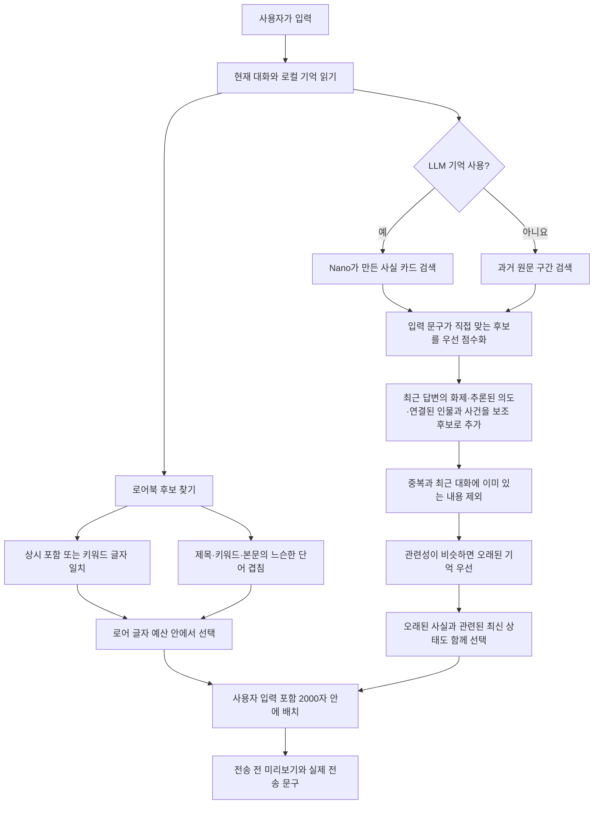

# Trace


크랙 대화에서 관련 기억과 로어북을 골라 전송 문구에 붙이는 비공식 브라우저 도구입니다. 확장 프로그램은 기억 생성에 브라우저 내장 Gemini Nano를 사용할 수 있고, Tampermonkey 버전은 모델 없이 작동합니다.

> **실험판:** 자동 기억의 정확도는 아직 검증되지 않았습니다. 실제 출력에서 이름 분리, 키워드 오분류, 무관한 문구 혼입을 확인했습니다. 중요한 기억은 덱에서 확인·수정하고, 전송 전 프롬프트 미리보기를 확인하세요. 이 저장소는 크랙/Wrtn의 공식 제품이 아닙니다.

| 버전 | 기억 생성 | 사용 환경 |
| --- | --- | --- |
| Chrome 확장 프로그램 (`extension/`) | 브라우저 내장 Gemini Nano가 완료된 AI 응답을 묶음으로 읽고 사실을 기록 | 데스크톱 Chrome |
| Tampermonkey 스크립트 (`dist/`) | LSA·BM25 기반 추출식 기억, 별도 모델 불필요 | 데스크톱·모바일 브라우저 |

대화와 기억은 브라우저 로컬 저장소에 보관합니다. 확장 프로그램은 크랙 계정의 채팅을 크랙 API에서 읽으며, 모델 레이더는 별도로 IGX Radiosonde의 공개 측정 API를 조회합니다. Gemini Nano를 선택한 경우 기억 생성은 브라우저 내장 모델에서 실행됩니다.

## 크랙 화면에서 쓰는 방법

Trace의 주 화면은 크랙 대화 입력창 바로 위에 뜹니다. **기억덱**에서 자동으로 적힌 사실과 출처를 보고, 필요하면 주입을 끄거나 문장을 고칩니다. **로어북**에서 설정을 관리하고, **프롬프트**에서 이번 입력에 실제로 붙을 내용을 전송 전에 확인합니다. **기억 갱신**은 아직 읽지 않은 응답을 처리합니다. 화면의 카드에 표시된 대화 번호를 누르면 근거가 된 대화로 이동할 수 있습니다.

| 화면 | 확인하거나 하는 일 |
| --- | --- |
| 입력창 위 버튼 | 기억 건수와 갱신 상태 확인, 기억덱·유저노트·로어북·프롬프트 열기 |
| 기억덱 | 인물·장소·기술 등으로 필터, 원문 출처 확인, 사실 수정·삭제·주입 끄기 |
| 프롬프트 미리보기 | 지금 쓴 입력에 어떤 기억과 로어가 붙는지 전송 전에 확인 |
| 설정 & 통계 | 기억 방식과 자동 주입을 선택하고 실제 전송 횟수 확인 |

## 확장 프로그램

1. Chrome 확장 프로그램 관리 화면에서 개발자 모드를 켜고 `extension/` 폴더를 압축해제된 확장 프로그램으로 로드합니다.
2. 크랙 대화방에서 입력창 위 **기억 갱신**을 누릅니다. 모델 준비 화면이 자동으로 열립니다.
3. 내장 모델을 처음 사용하는 경우 **모델 받기**를 누릅니다. 이미 준비된 모델에는 이 버튼이 보이지 않습니다.
4. 로컬 분석이 인물·장소·사건 후보를 찾고, Nano가 원문을 읽어 짧은 사실로 기록합니다. 한 번에 읽는 분량은 **모델 입력 한도**에 맞춰 정합니다. 다음 묶음이 한도를 넘기 직전, 읽지 않은 응답이 오래되기 전, 또는 **기억 갱신**을 눌렀을 때 처리합니다.
5. 입력창 위 진행 막대는 실제로 처리된 턴 수에 따라 움직입니다. **프롬프트**에서 현재 입력과 직전 AI 응답을 기준으로 선택된 기억과 실제 전송 문구를 확인할 수 있습니다.

입력창 위 **기억덱**을 열면 사실마다 수정·삭제·주입 끄기를 할 수 있습니다. **키워드 제외**는 같은 키워드의 모든 사실을 숨기고 다음 분석에서도 빼며, 사이드패널의 **제외 후보 찾기**에서도 적용할 수 있습니다. **전체 다시 읽기**는 기존 기억을 새 방식으로 다시 만들고, 완료 전까지 기존 기억을 유지합니다. 수동 수정·삭제·비활성화는 재분석 후에도 로컬 덮어쓰기로 유지됩니다.

전송 문구는 사용자 입력까지 합쳐 **2000자**를 넘지 않습니다. 선택된 자료는 출처 순번이 적힌 `<!--TRACE-->` 기억 블록으로 입력 앞에 붙습니다. 현재 대화에 이미 보이는 최근 기억과 반복되는 내용은 후보에서 제외합니다. 모델을 사용할 수 없으면 상태를 표시하고, 설정에서 **LLM 기억**을 끄면 원문 구간 검색을 사용합니다.

### 기억과 로어를 고르는 방법



**입력 문구와 직접 맞는 기억이 우선**입니다. 직전 AI 응답의 화제, Nano가 추론한 지시 대상, 같은 턴·인물로 연결된 사실은 보조 자료로만 더합니다. 오래된 사실을 고를 때는 같은 대상의 최신 상태도 함께 보여 주어 과거 상태를 현재로 오해하지 않게 합니다. 마지막에는 중복과 글자 예산을 고려해 담고, 대화 순서로 읽히게 정렬합니다.

**LLM 기억을 끄면** 모델이 작성한 사실 카드 대신 과거 원문을 화자·장면과 함께 작은 구간으로 검색합니다. 사용자 입력의 검색 점수를 중심에 두고 직전 답변은 보조 점수로 사용합니다. 원문 검색에는 공용 엔진의 BM25·LSA 신호를 사용합니다.

**로어 선정은 별도 방식**입니다. `상시 포함`, 설정한 키워드의 글자 일치, 또는 제목·키워드·본문과 입력 사이의 느슨한 단어 겹침을 사용합니다. 화면의 “시맨틱”은 이 마지막 조건의 이름일 뿐, 로어에 BM25·LSA 검색이나 임베딩을 적용한다는 뜻이 아닙니다. 선정된 로어도 남은 글자 예산에 맞아야 주입됩니다.

**설정 & 통계**는 현재 채팅의 Nano 처리 턴, 대기 턴, 기억 사실 수와 실제 전송 및 주입 횟수를 보여줍니다. 프롬프트 미리보기 횟수는 전송 통계에 포함하지 않습니다.

**모델 레이더**와 크랙 모델 선택창의 점수 배지는 같은 `modelScores` 저장값을 읽습니다. 레이더는 측정된 전체 모델을, 선택창은 이름이 확인된 모델만 표시합니다. 새로고침은 측정 갱신이 끝난 뒤 동일한 저장값을 다시 읽습니다.

페르소나는 크랙 기본 기능에서 관리합니다. 확장의 중복 페르소나 화면은 제거했습니다. 기존 로컬 초안은 자동으로 삭제하지 않습니다.

## Tampermonkey

```sh
node build.mjs
```

생성된 `dist/trace-lite.user.js`를 Tampermonkey에 등록한 뒤 크랙 대화방을 엽니다. 확장 프로그램과 **같은 검색 엔진**으로 과거 원문 구간과 로어북을 고르며, 브라우저 내장 모델은 사용하지 않습니다. 전송 총량은 사용자 입력 포함 2000자입니다. 확장 프로그램과 탬퍼몽키판을 같은 방에서 동시에 켜면 두 도구가 모두 전송을 수정할 수 있으므로 한 가지만 사용하세요.

## 개발 확인

```sh
node --check extension/background/service-worker.js
node --check extension/content/content.js
node --check extension/sidepanel/sidepanel.js
node --test test/*.test.mjs
```

## 현재 확인된 한계

- Nano 기억의 키워드와 대화 번호는 원문과 대조하지만, 사실 문장 전체의 진위는 아직 검증하지 못합니다. 같은 인물을 다른 키워드로 나누거나, 오래된 상태를 현재 상태처럼 남길 수 있습니다.
- 한국어 Nano 품질과 실제 주입 효과에 대한 원문 기반 평가는 아직 진행하지 않았습니다. 자동 테스트는 코드 동작만 확인합니다.
- 로어의 느슨한 단어 겹침은 의미를 이해하는 검색이 아닙니다. 로어에도 기억과 같은 BM25·LSA를 적용하는 개선은 아직 구현하지 않았습니다.
- 공개 화면 예시는 개인 대화가 포함되지 않은 샘플로 검증한 뒤 추가합니다.
