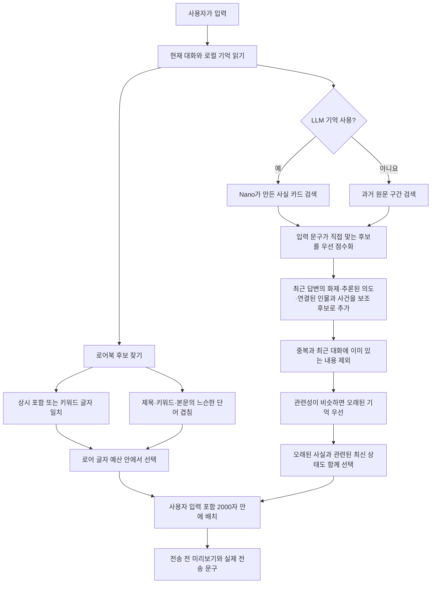

# Trace


크랙 대화에서 관련 기억과 로어북을 골라 전송 문구에 붙이는 비공식 브라우저 도구입니다. 확장 프로그램은 기억 생성에 브라우저 내장 Gemini Nano를 사용할 수 있고, Tampermonkey 버전은 모델 없이 작동합니다.

> **실험판:** 자동 기억의 정확도는 아직 검증되지 않았습니다. 실제 출력에서 이름 분리, 키워드 오분류, 무관한 문구 혼입을 확인했습니다. 중요한 기억은 덱에서 확인·수정하고, 전송 전 프롬프트 미리보기를 확인하세요. 이 저장소는 크랙/Wrtn의 공식 제품이 아닙니다.

| 버전 | 기억 생성 | 사용 환경 |
| --- | --- | --- |
| Chrome 확장 프로그램 (`extension/`) | 브라우저 내장 Gemini Nano가 완료된 AI 응답을 묶음으로 읽고 사실을 기록 | 데스크톱 Chrome |
| Tampermonkey 스크립트 (`dist/`) | LSA·BM25 기반 원문 검색, 별도 모델 불필요 | Tampermonkey를 지원하는 브라우저 |

대화와 기억은 브라우저 로컬 저장소에 보관합니다. 확장 프로그램은 크랙 계정의 채팅을 크랙 API에서 읽으며, 모델 레이더는 별도로 IGX Radiosonde의 공개 측정 API를 조회합니다. Gemini Nano를 선택한 경우 기억 생성은 브라우저 내장 모델에서 실행됩니다.

## 설치

둘 중 **한 가지만** 설치하세요. 같은 크랙 대화방에서 두 버전을 함께 켜면 전송 문구를 중복으로 수정할 수 있습니다. 일반 사용에는 Node.js나 저장소 복제가 필요하지 않습니다.

### Chrome 확장 프로그램

1. [v0.8.0 릴리즈](https://github.com/CREE1116/crack-trace/releases/tag/v0.8.0)에서 `trace-extension-v0.8.0.zip`을 내려받아 압축을 풉니다.
2. Chrome 주소창에 `chrome://extensions`를 입력하고 오른쪽 위 **개발자 모드**를 켭니다.
3. **압축해제된 확장 프로그램을 로드합니다**를 눌러 압축을 푼 **`extension` 폴더**를 선택합니다. 이 폴더 안에 `manifest.json`이 바로 보여야 합니다. ZIP 파일 자체나 상위 폴더를 선택하면 설치되지 않습니다. ([Chrome 안내](https://developer.chrome.com/docs/extensions/get-started/tutorial/hello-world#load-unpacked))
4. [크랙 대화방](https://crack.wrtn.ai/)을 열거나 새로고침합니다. 입력창 위에 **🌿 기억**, **📝 유저노트**, **📜 로어북**, **👁️ 프롬프트** 버튼이 보이면 설치된 것입니다.
5. Nano로 기억을 만들려면 **기억 갱신**을 누르고, 처음 안내가 뜨면 **모델 받기**를 진행합니다. 모델을 쓰지 않으려면 Trace **설정 → LLM으로 기억 만들기**를 끄세요. 이때는 과거 대화 원문 구간을 검색합니다.

업데이트할 때는 기존 `extension` 폴더의 파일을 새 릴리즈 파일로 교체하고 `chrome://extensions`의 Trace 카드에서 **새로고침**을 누른 뒤 크랙 탭도 새로고침합니다. 저장된 기억을 유지하려면 기존 확장 프로그램을 제거하지 마세요.

### Tampermonkey판

1. 사용하는 브라우저에 [Tampermonkey](https://www.tampermonkey.net/)를 설치합니다.
2. [v0.8.0 릴리즈](https://github.com/CREE1116/crack-trace/releases/tag/v0.8.0)에서 `trace-lite.user.js`를 내려받습니다.
3. Tampermonkey 대시보드에서 **새 스크립트 만들기**를 열고 기본 내용을 전부 지운 뒤, 내려받은 파일의 **전체 내용**을 붙여넣고 저장합니다. 스크립트 이름은 **Trace Lite**입니다.
4. 크랙 대화방을 새로고침합니다. 화면에 **기억 준비 중…** 또는 **🧠 기억** 버튼이 나타나면 설치된 것입니다. 버튼을 눌러 실시간 매칭과 로어북을 확인할 수 있습니다.

Chrome 계열에서 스크립트가 실행되지 않으면 Tampermonkey 확장 프로그램의 **사용자 스크립트 허용** 또는 Chrome의 **개발자 모드** 설정을 확인하세요. ([Tampermonkey 안내](https://www.tampermonkey.net/faq.php?q=Q209)) 업데이트할 때는 새 `trace-lite.user.js`의 전체 내용으로 기존 **Trace Lite** 스크립트를 교체합니다.

## 크랙 화면에서 쓰는 방법

Trace의 주 화면은 크랙 대화 입력창 바로 위에 뜹니다. **기억덱**에서 자동으로 적힌 사실과 출처를 보고, 필요하면 주입을 끄거나 문장을 고칩니다. **로어북**에서 설정을 관리하고, **프롬프트**에서 이번 입력에 실제로 붙을 내용을 전송 전에 확인합니다. **기억 갱신**은 아직 읽지 않은 응답을 처리합니다. 화면의 카드에 표시된 대화 번호를 누르면 근거가 된 대화로 이동할 수 있습니다.

아래는 [공개 샘플 대화방](https://crack.wrtn.ai/stories/6aba9e6d1b2084a0b31777e6/episodes/6abb948edecf759e02beb886)에서 캡처한 실제 화면입니다. 자동 생성된 사실은 사용 전에 원문과 대조하세요.

**전송 전 프롬프트:** 이번 입력에 선택된 기억과 최종 전송 문구를 확인합니다.


**기억덱:** 기억의 출처를 열고, 주입 여부를 바꾸거나 사실을 수정합니다.


**로어북과 설정:** 로어를 등록하고, 기억 생성·자동 주입·화면 표시를 관리합니다.

| 로어북 | 설정 |
| --- | --- |
| [](docs/images/trace-lorebook.png) | [](docs/images/trace-settings.png) |

| 화면 | 확인하거나 하는 일 |
| --- | --- |
| 입력창 위 버튼 | 기억 건수와 갱신 상태 확인, 기억덱·유저노트·로어북·프롬프트 열기 |
| 기억덱 | 인물·장소·기술 등으로 필터, 원문 출처 확인, 사실 수정·삭제·주입 끄기 |
| 프롬프트 미리보기 | 지금 쓴 입력에 어떤 기억과 로어가 붙는지 전송 전에 확인 |
| 설정 & 통계 | 기억 방식과 자동 주입을 선택하고 실제 전송 횟수 확인 |

## 확장 프로그램 사용

크랙 대화방에서 입력창 위 **기억 갱신**을 누르면 모델 준비 화면이 열립니다. 내장 모델을 처음 사용하는 경우 **모델 받기**를 누릅니다. 이미 준비된 모델에는 이 버튼이 보이지 않습니다.

로컬 분석이 인물·장소·사건 후보를 찾고, Nano가 원문을 읽어 짧은 사실로 기록합니다. 한 번에 읽는 분량은 **모델 입력 한도**에 맞춰 정합니다. 다음 묶음이 한도를 넘기 직전, 읽지 않은 응답이 오래되기 전, 또는 **기억 갱신**을 눌렀을 때 처리합니다. 입력창 위 진행 막대는 실제로 처리된 턴 수에 따라 움직입니다. **프롬프트**에서 현재 입력과 직전 AI 응답을 기준으로 선택된 기억과 실제 전송 문구를 확인할 수 있습니다.

입력창 위 **기억덱**을 열면 사실마다 수정·삭제·주입 끄기를 할 수 있습니다. **키워드 제외**는 같은 키워드의 모든 사실을 숨기고 다음 분석에서도 빼며, 사이드패널의 **제외 후보 찾기**에서도 적용할 수 있습니다. **전체 다시 읽기**는 기존 기억을 새 방식으로 다시 만들고, 완료 전까지 기존 기억을 유지합니다. 수동 수정·삭제·비활성화는 재분석 후에도 로컬 덮어쓰기로 유지됩니다.

전송 문구는 사용자 입력까지 합쳐 **2000자**를 넘지 않습니다. 선택된 자료는 출처 순번이 적힌 `<!--TRACE-->` 기억 블록으로 입력 앞에 붙습니다. 현재 대화에 이미 보이는 최근 기억과 반복되는 내용은 후보에서 제외합니다. 모델을 사용할 수 없으면 상태를 표시하고, 설정에서 **LLM 기억**을 끄면 원문 구간 검색을 사용합니다.

### 기억과 로어를 고르는 방법



**입력 문구와 직접 맞는 기억이 우선**입니다. 직전 AI 응답의 화제, Nano가 추론한 지시 대상, 같은 턴·인물로 연결된 사실은 보조 자료로만 더합니다. 오래된 사실을 고를 때는 같은 대상의 최신 상태도 함께 보여 주어 과거 상태를 현재로 오해하지 않게 합니다. 마지막에는 중복과 글자 예산을 고려해 담고, 대화 순서로 읽히게 정렬합니다.

**LLM 기억을 끄면** 모델이 작성한 사실 카드 대신 과거 원문을 화자·장면과 함께 작은 구간으로 검색합니다. 사용자 입력의 검색 점수를 중심에 두고 직전 답변은 보조 점수로 사용합니다. 원문 검색에는 공용 엔진의 BM25·LSA 신호를 사용합니다.

**로어 선정은 별도 방식**입니다. `상시 포함`, 설정한 키워드의 글자 일치, 또는 제목·키워드·본문과 입력 사이의 느슨한 단어 겹침을 사용합니다. 화면의 “시맨틱”은 이 마지막 조건의 이름일 뿐, 로어에 BM25·LSA 검색이나 임베딩을 적용한다는 뜻이 아닙니다. 선정된 로어도 남은 글자 예산에 맞아야 주입됩니다.

#### 로어 선정식 (현재 구현)

검색 문장 `q`는 **현재 입력 + 직전 AI 응답의 앞 600자**입니다. 검색어 추출 함수 `T(x)`는 NFKC 정규화와 소문자 변환 뒤, 2글자 이상인 한국어 연속 문자열의 **전체 형태와 인접한 두 글자 조각**, 2글자 이상인 영문·숫자·밑줄 단어를 반환합니다. 형태소 분석이나 의미 임베딩은 사용하지 않습니다.

각 로어 `i`에 대해 다음을 계산합니다. `Kᵢ`는 검색 문장에 포함되거나 `T(q)`와 일치한 등록 키워드의 개수입니다. `Cᵢ = Σ(t ∈ T(q)) 1[t ∈ set(T(제목 + 키워드 + 본문))]`은 겹친 항목 수이며, **검색 문장에서 같은 조각이 반복되면 여러 번 셉니다.** 특히 한국어 두 글자 단어는 전체 형태와 두 글자 조각이 같아서 한 번 등장해도 `Cᵢ`에 두 번 더해질 수 있습니다.

| 조건 | 점수와 선정 |
| --- | --- |
| 상시 주입 | `100점` |
| 키워드 직접 일치 `Kᵢ > 0` | `12 × Kᵢ`점 |
| 직접 일치가 없고 “시맨틱” 허용 | `Cᵢ ≥ 2`면 `2.5 × Cᵢ`점. 검색 항목이 4개 이하일 때는 한 항목만 겹쳐도 **제목에 검색 문장 전체가 포함되면** 선정 |
| 위 조건에 해당 없음 | 제외 |

점수순으로 살피며 글자 예산을 넘는 로어는 건너뜁니다. 로어 예산은 남은 글자 수 `R`에 대해 `min(600, floor(0.55 × R))`입니다. **상시 주입도 예산을 넘으면 빠집니다.** 현재 화면의 “시맨틱 벡터”라는 이름과 달리 실제 계산은 글자 조각의 집합 겹침입니다. 또한 현재 구현은 “시맨틱만”을 선택해도 **키워드 직접 일치가 먼저 적용**되고, “키워드만”은 겹침 검색만 끕니다.

**설정 & 통계**는 현재 채팅의 Nano 처리 턴, 대기 턴, 기억 사실 수와 실제 전송 및 주입 횟수를 보여줍니다. 프롬프트 미리보기 횟수는 전송 통계에 포함하지 않습니다.

**모델 레이더**와 크랙 모델 선택창의 점수 배지는 같은 `modelScores` 저장값을 읽습니다. 레이더는 측정된 전체 모델을, 선택창은 이름이 확인된 모델만 표시합니다. 새로고침은 측정 갱신이 끝난 뒤 동일한 저장값을 다시 읽습니다.

페르소나는 크랙 기본 기능에서 관리합니다. 확장의 중복 페르소나 화면은 제거했습니다. 기존 로컬 초안은 자동으로 삭제하지 않습니다.

## Tampermonkey

설치 방법은 위의 [Tampermonkey판 설치](#tampermonkey판)를 따르세요. 확장 프로그램과 **같은 검색 엔진**으로 과거 원문 구간과 로어북을 고르며, 브라우저 내장 모델은 사용하지 않습니다. 전송 총량은 사용자 입력 포함 2000자입니다.

## 개발 확인

```sh
node build.mjs
node --check extension/background/service-worker.js
node --check extension/content/content.js
node --check extension/sidepanel/sidepanel.js
node --test test/*.test.mjs
```

## 현재 확인된 한계

- Nano 기억의 키워드와 대화 번호는 원문과 대조하지만, 사실 문장 전체의 진위는 아직 검증하지 못합니다. 같은 인물을 다른 키워드로 나누거나, 오래된 상태를 현재 상태처럼 남길 수 있습니다.
- 한국어 Nano 품질과 실제 주입 효과에 대한 원문 기반 평가는 아직 진행하지 않았습니다. 자동 테스트는 코드 동작만 확인합니다.
- 로어의 느슨한 단어 겹침은 의미를 이해하는 검색이 아닙니다. 로어에도 기억과 같은 BM25·LSA를 적용하는 개선은 아직 구현하지 않았습니다.
