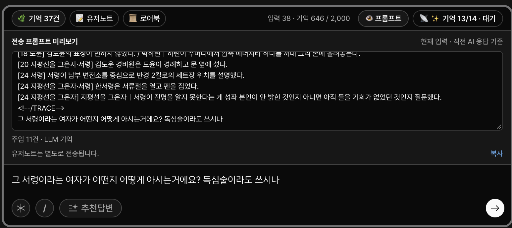
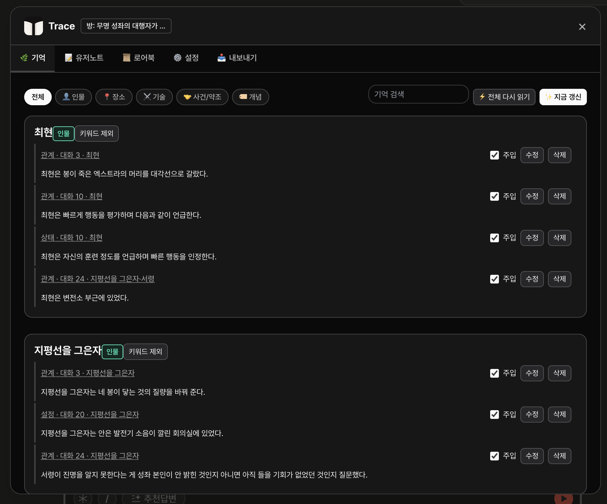
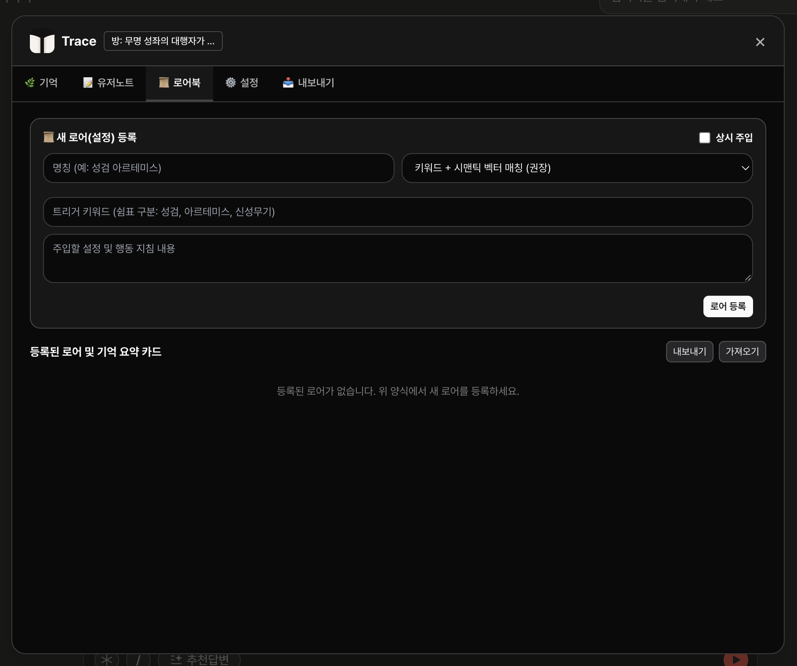
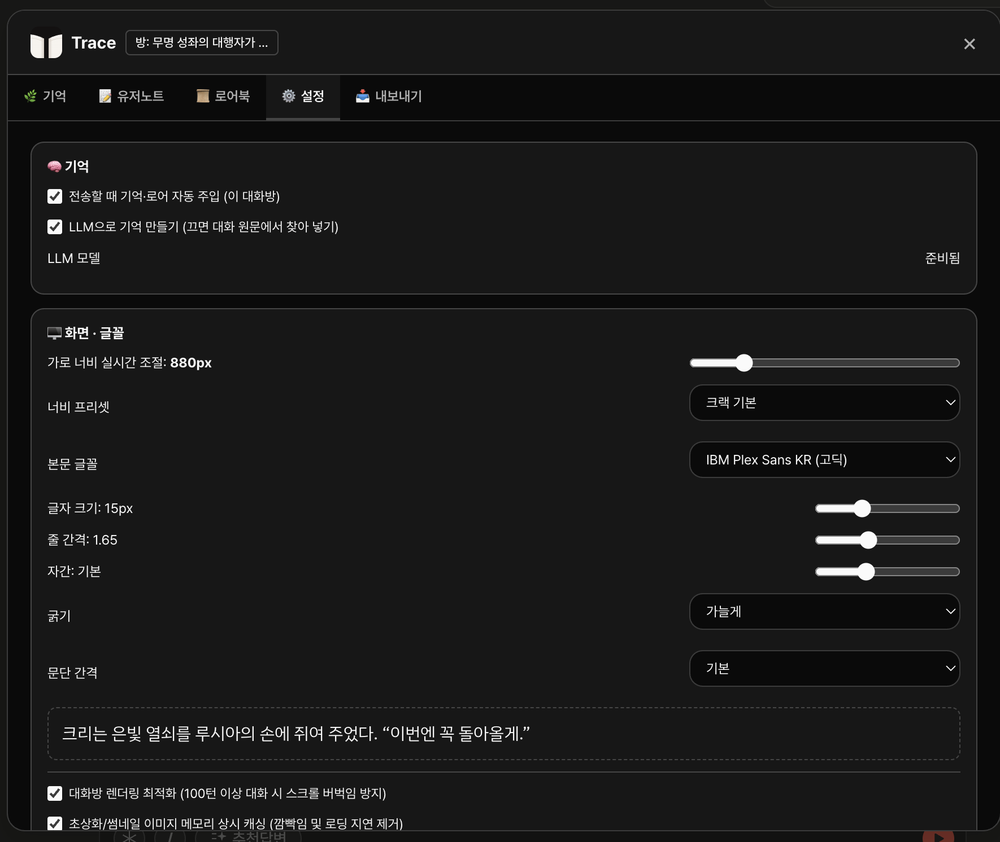

# Trace


크랙 대화에서 관련 기억과 로어북을 골라 전송 문구에 붙이는 비공식 브라우저 도구입니다. 확장 프로그램은 기억 생성에 브라우저 내장 Gemini Nano를 사용할 수 있고, Tampermonkey 버전은 모델 없이 작동합니다.

> **실험판:** 자동 기억의 정확도는 아직 검증되지 않았습니다. 실제 출력에서 이름 분리, 키워드 오분류, 무관한 문구 혼입을 확인했습니다. 중요한 기억은 덱에서 확인·수정하고, 전송 전 프롬프트 미리보기를 확인하세요. 이 저장소는 크랙/Wrtn의 공식 제품이 아닙니다.

| 버전 | 기억 생성 | 사용 환경 |
| --- | --- | --- |
| Chrome 확장 프로그램 (`extension/`) | 브라우저 내장 Gemini Nano가 완료된 AI 응답을 묶음으로 읽고 사실을 기록 | 데스크톱 Chrome |
| Tampermonkey 스크립트 (`dist/`) | BM25·LSA 기반 원문 검색, 별도 모델 불필요 | Tampermonkey를 지원하는 브라우저 |

대화와 기억은 브라우저 로컬 저장소에 보관합니다. 확장 프로그램은 크랙 계정의 채팅을 크랙 API에서 읽으며, 모델 레이더는 별도로 IGX Radiosonde의 공개 측정 API를 조회합니다. Gemini Nano를 선택한 경우 기억 생성은 브라우저 내장 모델에서 실행됩니다.

## 설치

둘 중 **한 가지만** 설치하세요. 같은 크랙 대화방에서 두 버전을 함께 켜면 전송 문구를 중복으로 수정할 수 있습니다. 일반 사용에는 Node.js나 저장소 복제가 필요하지 않습니다.

### Chrome 확장 프로그램

1. [최신 릴리즈](https://github.com/CREE1116/crack-trace/releases/latest)에서 `trace-extension-vX.Y.Z.zip`을 내려받아 압축을 풉니다.
2. Chrome 주소창에 `chrome://extensions`를 입력하고 오른쪽 위 **개발자 모드**를 켭니다.
3. **압축해제된 확장 프로그램을 로드합니다**를 눌러 압축을 푼 **`extension` 폴더**를 선택합니다. 이 폴더 안에 `manifest.json`이 바로 보여야 합니다. ZIP 파일 자체나 상위 폴더를 선택하면 설치되지 않습니다. ([Chrome 안내](https://developer.chrome.com/docs/extensions/get-started/tutorial/hello-world#load-unpacked))
4. [크랙 대화방](https://crack.wrtn.ai/)을 열거나 새로고침합니다. 입력창 위에 **🌿 기억**, **📝 유저노트**, **📜 로어북**, **👁️ 프롬프트** 버튼이 보이면 설치된 것입니다.
5. Nano로 기억을 만들려면 **기억 갱신**을 누르고, 처음 안내가 뜨면 **모델 받기**를 진행합니다. 모델을 쓰지 않으려면 Trace **설정 → LLM으로 기억 만들기**를 끄세요. 이때는 과거 대화 원문 구간을 검색합니다.

업데이트할 때는 기존 `extension` 폴더의 파일을 새 릴리즈 파일로 교체하고 `chrome://extensions`의 Trace 카드에서 **새로고침**을 누른 뒤 크랙 탭도 새로고침합니다. 저장된 기억을 유지하려면 기존 확장 프로그램을 제거하지 마세요.

### Tampermonkey판

1. 사용하는 브라우저에 [Tampermonkey](https://www.tampermonkey.net/)를 설치합니다.
2. **[Trace Lite 설치](https://raw.githubusercontent.com/CREE1116/crack-trace/main/dist/trace-lite.user.js)** 링크를 엽니다. Tampermonkey 설치 화면이 뜨면 **설치**를 누릅니다.
3. 크랙 대화방을 새로고침합니다. 화면에 **기억 준비 중…** 또는 **🧠 기억** 버튼이 나타나면 설치된 것입니다. 버튼을 눌러 실시간 매칭과 로어북을 확인할 수 있습니다.

Chrome 계열에서 스크립트가 실행되지 않으면 Tampermonkey 확장 프로그램의 **사용자 스크립트 허용** 또는 Chrome의 **개발자 모드** 설정을 확인하세요. ([Tampermonkey 안내](https://www.tampermonkey.net/faq.php?q=Q209)) 위 링크로 설치한 스크립트는 Tampermonkey가 주기적으로 새 버전을 확인해 **자동으로 업데이트**합니다. 바로 받으려면 대시보드에서 Trace Lite의 **업데이트 확인**을 누르세요. 예전에 붙여넣기로 설치했다면 한 번만 위 링크로 다시 설치하면 이후부터 자동으로 갱신됩니다.

## 크랙 화면에서 쓰는 방법

Trace의 주 화면은 크랙 대화 입력창 바로 위에 뜹니다. **기억덱**에서 자동으로 적힌 사실과 출처를 보고, 필요하면 주입을 끄거나 문장을 고칩니다. **로어북**에서 설정을 관리하고, **프롬프트**에서 이번 입력에 실제로 붙을 내용을 전송 전에 확인합니다. **기억 갱신**은 아직 읽지 않은 응답을 처리합니다. 화면의 카드에 표시된 대화 번호를 누르면 근거가 된 대화로 이동할 수 있습니다.

아래는 [공개 샘플 대화방](https://crack.wrtn.ai/stories/6aba9e6d1b2084a0b31777e6/episodes/6abb948edecf759e02beb886)에서 캡처한 실제 화면입니다. 자동 생성된 사실은 사용 전에 원문과 대조하세요.

**전송 전 프롬프트:** 이번 입력에 선택된 기억과 최종 전송 문구를 확인합니다.



**기억덱:** 기억의 출처를 열고, 주입 여부를 바꾸거나 사실을 수정합니다.



**로어북과 설정:** 로어를 등록하고, 기억 생성·자동 주입·화면 표시를 관리합니다.

| 로어북 | 설정 |
| --- | --- |
| [](docs/images/trace-lorebook.png) | [](docs/images/trace-settings.png) |

| 화면 | 확인하거나 하는 일 |
| --- | --- |
| 입력창 위 버튼 | 기억 건수와 갱신 상태 확인, 기억덱·유저노트·로어북·찾기·메모·프롬프트 열기 |
| 기억덱 | 인물·장소·기술 등으로 필터, 원문 출처 확인, 사실 수정·삭제·주입 끄기, 기억 한 건이나 키워드 전체를 **📌 고정** |
| 프롬프트 미리보기 | 지금 쓴 입력에 붙을 기억과 로어를 들어온 이유와 함께 확인하고, 체크를 풀어 **이번 전송에서만 빼기** |
| 🔎 찾기 | 크랙 화면에 아직 불러오지 않은 옛 대화까지 검색(상태창 포함). 적은 그대로 들어 있는 곳을 오래된 순으로, 그다음 비슷한 곳을 보여 주고, 누르면 그 턴으로 이동 |
| 🗒️ 메모 | 자주 쓰는 문구를 눌러 넣기. 앞의 10개는 **Alt(⌥)+1…0**, 대체어(예: `;전투`)를 치고 스페이스를 누르면 메모로 바뀜(아이폰 텍스트 대치처럼). 모든 대화방 공용 또는 이 대화방 전용 |
| 설정 & 통계 | 기억 방식과 자동 주입을 선택하고 실제 전송 횟수 확인 |

## 확장 프로그램 사용

크랙 대화방에서 입력창 위 **기억 갱신**을 누르면 모델 준비 화면이 열립니다. 내장 모델을 처음 사용하는 경우 **모델 받기**를 누릅니다. 이미 준비된 모델에는 이 버튼이 보이지 않습니다.

로컬 분석이 인물·장소·사건 후보를 찾고, Nano가 원문을 읽어 짧은 사실로 기록합니다. 한 번에 읽는 분량은 **모델 입력 한도**에 맞춰 정합니다. 다음 묶음이 한도를 넘기 직전, 읽지 않은 응답이 오래되기 전, 또는 **기억 갱신**을 눌렀을 때 처리합니다. 입력창 위 진행 막대는 실제로 처리된 턴 수에 따라 움직입니다. **프롬프트**에서 현재 입력과 직전 AI 응답을 기준으로 선택된 기억과 실제 전송 문구를 확인할 수 있습니다.

입력창 위 **기억덱**을 열면 사실마다 수정·삭제·주입 끄기를 할 수 있습니다. **키워드 제외**는 같은 키워드의 모든 사실을 숨기고 다음 분석에서도 빼며, 사이드패널의 **제외 후보 찾기**에서도 적용할 수 있습니다. **전체 다시 읽기**는 기존 기억을 새 방식으로 다시 만들고, 완료 전까지 기존 기억을 유지합니다. 수동 수정·삭제·비활성화는 재분석 후에도 로컬 덮어쓰기로 유지됩니다.

**고정**한 기억·키워드·대화는 입력과 관계없이 매번 붙습니다. 셋이 합쳐 700자 안에서, 고정한 기억 → 고정한 대화 → 고정 키워드의 현재 기억(최신 순) 순서로 담습니다. 키워드 고정은 예전 상태로 밀려난 기억은 넣지 않습니다.

입력이 잠깐 멈출 때마다 전송 문구를 미리 준비해 두고, 보내는 순간 글자가 달라졌으면(치자마자 Enter, 마지막 글자 수정 등) 그 글자로 다시 준비해 붙입니다. 0.8초 안에 준비되지 않으면 기억 없이 보내고 입력창 위에 알립니다.

전송 문구는 사용자 입력까지 합쳐 **2000자**를 넘지 않습니다. 선택된 자료는 출처 순번이 적힌 `<!--TRACE-->` 기억 블록으로 입력 앞에 붙습니다. 현재 대화에 이미 보이는 최근 기억과 반복되는 내용은 후보에서 제외합니다. 모델을 사용할 수 없으면 상태를 표시하고, 설정에서 **LLM 기억**을 끄면 원문 구간 검색을 사용합니다.

### 기억과 로어를 고르는 방법

기억과 로어는 **같은 검색기**로 고릅니다. 보낼 때마다 모델을 돌리면 크랙이 느려지므로, 전송 시점에는 LLM을 쓰지 않고 가벼운 텍스트 검색만 합니다. LLM(Nano)은 대화를 미리 읽어 사실을 기록할 때만 씁니다.

```mermaid
flowchart TD
    A[사용자 입력 + 직전 AI 응답] --> T[검색어 추출<br/>단어 + 두 글자 조각]
    T --> B[BM25 + LSA<br/>단어 겹침]
    T --> R[관계 벡터<br/>로어 관계 + 기억한 사실]
    T -. 의미 검색 켬 .-> S[문장 임베딩<br/>e5-small]
    B --> F[순위 융합 RRF<br/>Σ 1/(60+순위)]
    R --> F
    S -.-> F
    subgraph 로어
      K[상시 포함 · 입력에 나온 키워드] --> LB[로어 예산 안에 먼저 담기]
      F --> LB
    end
    subgraph 기억
      C{LLM 기억 사용?} -- 예 --> M1[Nano 사실 카드]
      C -- 아니요 --> M2[과거 원문 구간]
      M1 --> F2[같은 순위 융합]
      M2 --> F2
      F2 --> N[최근 대화에 이미 있는 내용 제외<br/>오래된 기억 우선 + 같은 대상의 최신 상태]
    end
    LB --> O[사용자 입력 포함 2000자 안에 배치]
    N --> O
    O --> P[전송 전 미리보기 = 실제 전송 문구]
```

**검색 신호**

| 신호 | 보는 것 | 비용 |
| --- | --- | --- |
| BM25 (+ LSA 8주제) | 입력과 후보가 같은 단어·두 글자 조각을 얼마나 드물게, 많이 공유하는지 | 1ms 미만 |
| 관계 벡터 | 입력에 나온 인물·물건과 동사(“맡긴”, “쓰는”, “숨긴” 등)를 로어의 `주체 > 관계 > 대상` 표기와 Nano가 기억한 사실에 연결. “서령이 맡긴 물건” → 기억 “서령은 은빛 열쇠를 맡겼다” → 로어 `은빛 열쇠`. 입력 시점보다 뒤의 사실은 쓰지 않음 | 1ms 미만 |
| 의미 검색 (선택) | 문장 임베딩의 코사인 유사도. 겹치는 단어가 없어도 뜻이 가까운 후보를 찾음 | 입력 한 문장 임베딩, 수 ms |

신호마다 점수 단위가 달라서 **순위만 합칩니다(RRF, `Σ 1/(60+순위)`)**. 가중치 조정은 하지 않습니다.

**로어 선정 순서**

1. **상시 포함** 로어와, 등록 키워드가 **사용자 입력**에 그대로 나온 로어는 반드시 포함하고 예산을 먼저 받습니다. 직전 AI 응답에만 나온 키워드는 후보로만 올립니다. 트리거가 **키워드만**인 로어는 검색으로 들어오지 않습니다.
2. 나머지는 BM25 점수 5 초과, 관계 벡터 0.15 초과, 또는 직전 장면의 키워드 중 하나를 만족해야 후보가 됩니다. 아무 것도 넘지 못하면 **로어를 붙이지 않습니다**.
3. 의미 검색을 켜면 임베딩 순위가 융합에 더해지고, 가장 가까운 로어가 나머지보다 뚜렷하게 가까울 때(1위 − 중앙값 > 0.04)만 새로 들어옵니다.
4. 표시·전송 순서는 융합 순위입니다. 그래서 “아린이 쓰는 무기는?”에서는 키워드로 들어온 `아린`보다 관계로 찾은 `월광검`이 앞에 섭니다.

로어 예산은 남은 글자 수 `R`에 대해 `min(600, floor(0.55 × R))`이며, 예산을 넘는 로어는 건너뜁니다. 프롬프트 미리보기에서 로어마다 들어온 이유(`상시`, `키워드: …`, `내용·관계·의미`)를 볼 수 있습니다.

**로어 벤치마크** (`node tools/benchmark-lore.mjs`, 합성 로어 20개, 정답이 있는 입력 24개, 무관한 입력 8개)

| 방식 | 1순위 정답 | 3순위 안 정답 | 무관 입력에 안 붙임 |
| --- | --- | --- | --- |
| BM25 | 15/24 | 19/24 | 8/8 |
| TF-IDF 코사인 (제거) | 14/24 | 18/24 | 7/8 |
| 관계 벡터 | 17/24 | 20/24 | 8/8 |
| **현재 선정기** | **19/24** | **22/24** | **8/8** |

**기억** 쪽도 같은 방식입니다. LLM 기억을 켜면 Nano가 적은 사실 카드를, 끄면 과거 원문을 화자·장면 단위로 작게 나눈 구간을 검색합니다. 사용자 입력 점수가 중심이고 직전 답변은 보조입니다. 현재 대화에 이미 보이는 내용은 빼고, 관련성이 비슷하면 오래된 기억을 우선합니다(최근 것은 모델이 아직 기억하고 있을 가능성이 큼). 오래된 사실을 고르면 같은 대상의 최신 상태도 함께 붙여 과거 상태를 현재로 오해하지 않게 합니다. 개인 대화 30문항으로 측정한 원문 검색에서 의미 검색을 섞으면 상위 10개 안 정답이 17 → 20으로 늘었습니다.

**의미 검색 켜기:** 설정의 **의미 검색**을 켜면 브라우저 안에서 [multilingual-e5-small](https://huggingface.co/Xenova/multilingual-e5-small)(8비트, 약 118MB)과 실행 파일(약 27MB)을 한 번 받습니다. 기억·로어 벡터는 미리 계산해 브라우저에 저장하고, 보낼 때는 입력 한 문장만 계산합니다. 400ms 안에 답이 없으면 그 전송은 단어 검색만 씁니다.

**설정 & 통계**는 현재 채팅의 Nano 처리 턴, 대기 턴, 기억 사실 수와 실제 전송 및 주입 횟수를 보여줍니다. 프롬프트 미리보기 횟수는 전송 통계에 포함하지 않습니다.

**모델 레이더**와 크랙 모델 선택창의 점수 배지는 같은 `modelScores` 저장값을 읽습니다. 레이더는 측정된 전체 모델을, 선택창은 이름이 확인된 모델만 표시합니다. 새로고침은 측정 갱신이 끝난 뒤 동일한 저장값을 다시 읽습니다.

페르소나는 크랙 기본 기능에서 관리합니다. 확장의 중복 페르소나 화면은 제거했습니다. 기존 로컬 초안은 자동으로 삭제하지 않습니다.

## Tampermonkey

설치 방법은 위의 [Tampermonkey판 설치](#tampermonkey판)를 따르세요. 확장 프로그램과 **같은 검색 엔진**으로 과거 원문 구간과 로어북을 고르며, 브라우저 내장 모델은 사용하지 않습니다. 전송 총량은 사용자 입력 포함 2000자입니다.

## 개발 확인

`extension/engine/engine.js`와 `src/userscript.js`를 고치면 `node build.mjs`로 `dist/trace-lite.user.js`를 다시 만듭니다. 버전은 `extension/manifest.json`에서 읽습니다. 푸시·PR마다 GitHub Actions가 빌드가 최신인지와 테스트를 확인하고, 매니페스트 버전과 같은 태그(`v0.9.0` 등)를 올리면 확장 ZIP과 Trace Lite를 릴리즈에 올립니다(`CHANGELOG.md`의 해당 절이 릴리즈 노트).

```sh
node build.mjs
node --check extension/background/service-worker.js
node --check extension/content/content.js
node --check extension/sidepanel/sidepanel.js
node --test test/*.test.mjs
```

## 현재 확인된 한계

- Nano 기억의 키워드와 대화 번호는 원문과 대조하지만, 사실 문장 전체의 진위는 아직 검증하지 못합니다. 같은 인물을 다른 키워드로 나누거나, 오래된 상태를 현재 상태처럼 남길 수 있습니다.
- 한국어 Nano 품질과 실제 주입 효과에 대한 원문 기반 평가는 아직 진행하지 않았습니다. 자동 테스트는 코드 동작만 확인합니다.
- 기본 검색은 단어·글자 조각과 관계 표기를 쓰므로, 겹치는 말이 전혀 없는 바꿔 말하기는 찾지 못합니다(벤치마크의 `paraphrase` 사례). **의미 검색**을 켜면 일부 보완됩니다.
- 의미 검색은 모델 실행 파일(약 27MB)을 jsDelivr에서, 모델(약 118MB)을 Hugging Face에서 처음 한 번 받습니다. 받지 못하면 기존 검색만 사용합니다.
- 로어 벤치마크(`test/fixtures/lore-benchmark.json`)는 작은 합성 데이터입니다. 실제 로어북에서의 효과는 아직 측정하지 않았습니다.
